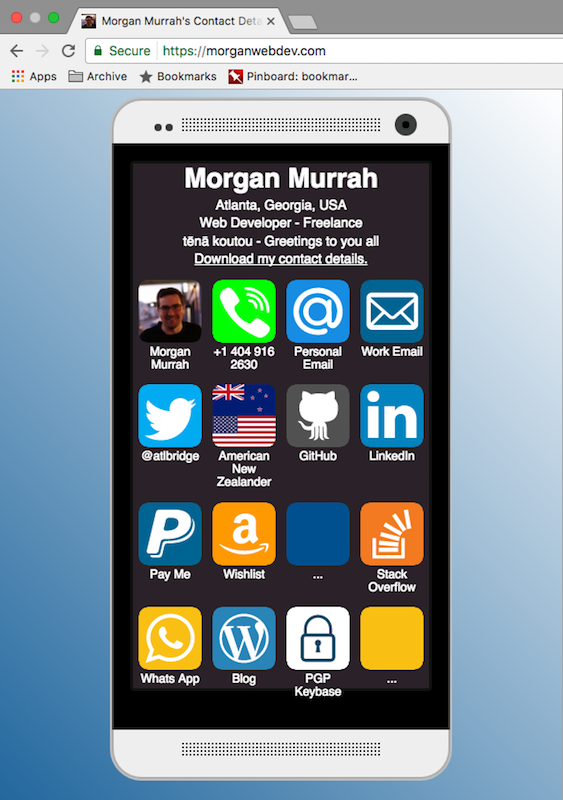
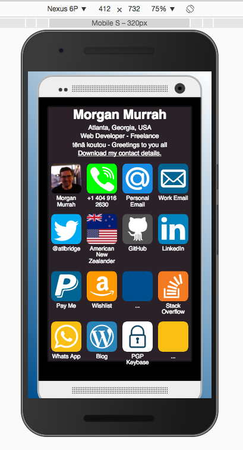

#### Get started - Morgan Murrah's personal website

 * Online: visit https://morganwebdev.com
* Local: 
  * `git clone https://github.com/airbr/newpersonal.git`
  * `cd` to `newpersonal
  * Serve the contents, i.e. `npm install http-server; http-server ./public/`
  * Visit address in browser i.e. 127.0.0.1:8080

#### Screenshots

##### Desktop

##### Mobile (With mobile phone frame)

   
#### Summary

 * Personal website. I wanted it to be fast, simple and practical. The focus is on giving clickable or pressable actions using just HTML as much as possible i.e. call my phone number with a compatible device/app on your system, click to see my Github. There are at least 7 ways to contact me, a way to pay me or buy me gifts and one wikipedia article to learn some about my heritage!
 
 * Technically/design wise, I wanted it to be mobile friendly, and this lead me to actually emulating a mobile phone with app-like buttons. But it also needed to be fast- no point in showing off any 'fancy JS' or animations here. See Credits for original CSS frame which provided a great mobile-first frame to work within.
 
 * On the fun side, the website has a very basic Service Worker enabling it for offline use (See: [github.com/airbr/wifiserviceworker](https://github.com/airbr/wifiServiceWorker). You can try it yourself by visiting my website offline and after refreshing your cache. The website should load with a blank screen (Im working on something fun for this)
 
  Update:
  
  # WOOHOO!
  After a few tries - my first test score was 69-  I made enough changes including add splash screen details and theme details for mobile users who might wish to save it to homescreen and wallah!
  
  
  
  
 
#### Technologies/techniques used

* Version control - Git. I.e this repository! 
* HTML5 - Schema.org/person markup
* SVG - My first time, largely working from examples.
* CSS3 - [Normalize](https://necolas.github.io/normalize.css/). Flexbox for handling rows in phone.
* Deployment-  Firebase Hosting which provisioned security certificates making it HTTPS enabled i.e. the nice green lock. Used with my custom domain provided by [iwantmyname.com](iwantmyname.com)

Credits:

* https://marvelapp.github.io/devices.css/ - For providing free Mobile Frames
* https://edent.tel/ - Inspiration for accessible formatting / usage of app icons