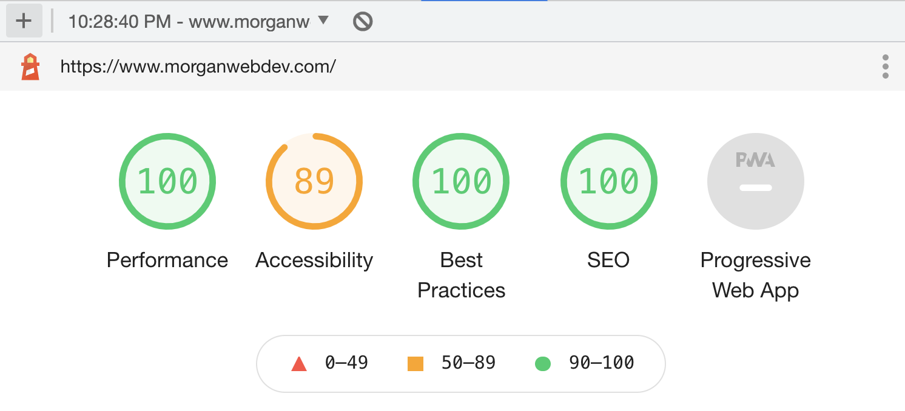
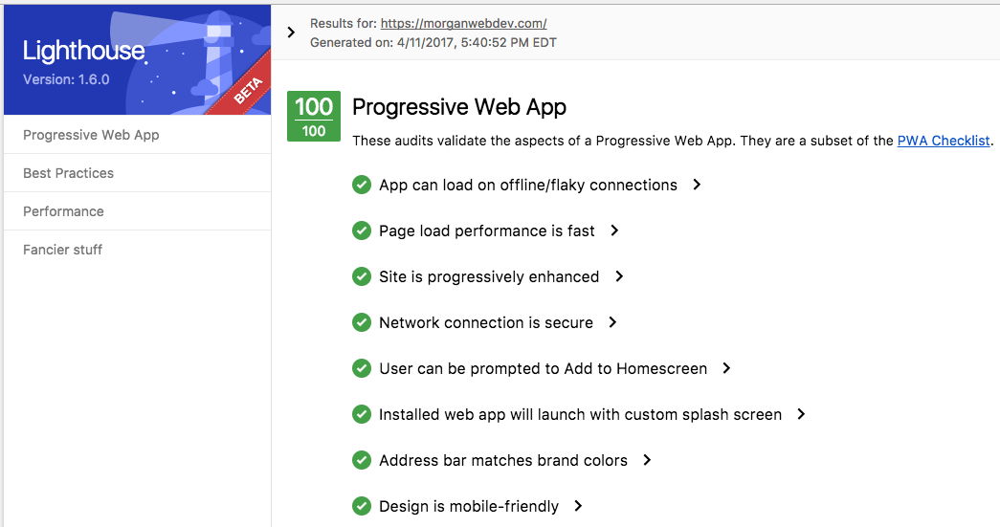

#### Morgan Murrah's personal website

### [Online at morganwebdev.com](https://morganwebdev.com) 

### Update 5.0

In 5.0 I simplified it even further... I removed Parcel and build commands entirely and just serve a static AMP page that is cached in the AMP Cache.

### Update 4.0

In version 4.0 I greatly simplified this repository down and moved the deployment from Firebase to Netlify. I removed dozens of dependencies from the package.json and simplified it down to two parcel.js commands. 

`npm run serve` to run the site.

`npm run build` to generate the site.

I removed the PWA functionality because it was... well a little unnecessary. Everything is served on one page. Now I just work to focus my effort on making the [HTML designed to last](https://jeffhuang.com/designed_to_last/).

#### Summary

 * My personal website. I wanted it to be: 
    * fast, 
    * simple
    * practical. 
    
 * The focus is on giving clickable or pressable actions using just HTML as much as possible i.e. call my phone number with a compatible device/app on your system, click to see my Github. There are several ways to contact me and some bits of fun like Wikipedia articles about my American New Zealander heritage.
 
 * I wanted it to be mobile friendly and this lead me to actually emulating a mobile phone with app-like buttons. See Credits for original CSS frame which provided a great mobile-first frame to work within.

#### 4.0

###### V 3.0:

Made some changes to the Icons/ changed a few details.

Thinking about removing the Vue CLI template entirely and just whittling it down to one special HTML page that is my precious. There is a lot going on here that I don't use, its really just some great use of HTML5 and SVG tiny icons it accomplishes all I need it to.
  
###### V 2.2:
  Just an update of a few addresses and icons. New color gradient. 
  
###### V 2.1:
Cleaned up Aria tags and actually tested website using ChromeVox Screenreader. Also added some basic [Firebase Functions functionality](https://github.com/firebase/functions-samples/tree/master/quickstarts/time-server).  
###### V 2.0:
   Added Adobe (for link to PDF Resume), Skype icon from this great SVG collection h/t: [SuperTinySocialIcons ](https://github.com/edent/SuperTinySocialIcons/). Removed Paypal icon. Various other changes. 
###### V 1.x
  
  # WOOHOO!
  After a few tries - my first test score was 69-  I made enough changes including add splash screen details and theme details for mobile users who might wish to save it to homescreen and wallah!
  
  
  
 
#### Technologies/techniques used. Some deprecated

* Version control - Git. I.e this repository! 
* HTML5 - Schema.org/person markup
* SVG - My first time, largely working from examples. [SVG Super Tiny Icons](https://github.com/edent/SuperTinyIcons)
* CSS3 - [Normalize](https://necolas.github.io/normalize.css/). Flexbox for handling rows in phone.
* Deployment-  Firebase Hosting which provisioned security certificates making it HTTPS enabled i.e. the nice green lock. Used with my custom domain provided by [iwantmyname.com](iwantmyname.com)

Credits:

* https://marvelapp.github.io/devices.css/ - For providing free Mobile Frames
* https://edent.tel/ - Inspiration for accessible formatting / usage of app icons